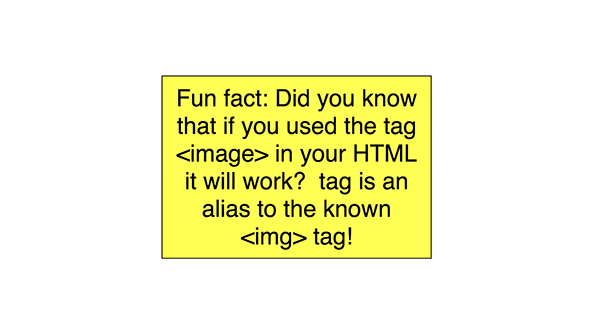
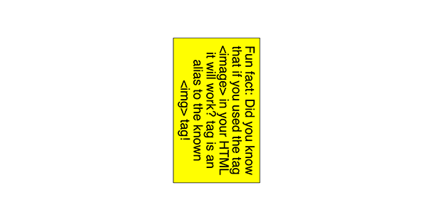
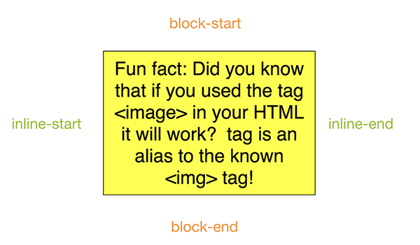
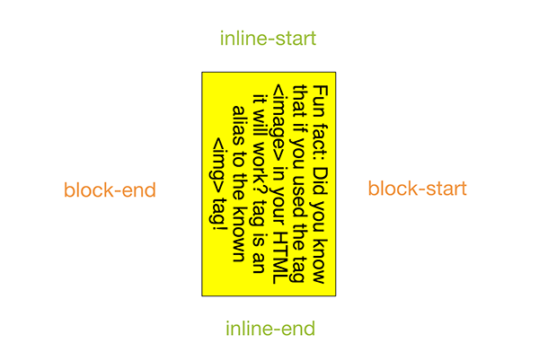

# Building multi-directional layouts

There are some new features in CSS that can assist us building layouts for different directions/languages with ease. This article is about CSS logical properties and values. These are a W3C working draft that still going under heavy editing. I want to talk about it because We've been using it for sometime and I have seen significant boost to our workflow after switching to it.

In this article, I’ll talk about the specifications and how can you use it today in your work. I live in Egypt where we use Arabic as a primary language. Arabic is written from right to left which means the websites created in Arabic look exactly like a mirror image of the English version. Most of the websites we create are bilingual which means we provide a stylesheet specific for each direction. We do that by flipping values / properties of almost everything! I will not talk in details about this part but if you wish you can talk a quick look about an [old article](https://alfy.me/2014/07/26/lets-talk-about-rtl.html) I wrote about the topic. Here I will talk about the new techniques that we started using.

It starts with declaring the `dir` attribute on the `html` tag. This attribute accepts one of two values; `ltr` which is the default value if none is specified or `rtl`. According to its value, the browser starts to paint the elements following a specific algorithm. Text will be written with respect to the direction and punctuations will be placed in their correct location. Some elements like tables will have their direction switched (`td`s starting from the right in `rtl` ). Thankfully, some new specifications like CSS grid and Flexible Box Module follow a similar approach to the table. That means we don't have to change order of anything because the browser will take care of it.

HTML5 introduced a new value for the `dir` attribute which is `auto`. This value follow a very simple rule, it will check for the first character within the element. If it belongs to a language that is written from left to right (like Latin characters) the element will have an `ltr` direction and vice versa. The W3C urge the authors to not rely on this value to determine the direction of the text and use a server-side solution. It has a very interesting use when you're not sure about the direction of the content. Like when it is generated by the users like comments. We see a lot of people contributing to discussions in Arabic websites using English. The support for `auto` is pretty good except for Internet Explorer and Edge.

## Introducing the :dir() pseudo-class

The `:dir()` pseudo-class is a new selector modifier that select an element by evaluating its `direction` value. It works like the following:

```CSS
/* Select all paragraphs that have their computed direction value set to rtl */
p:dir(rtl) {
  font-size: 16px;
}

/* Select all paragraphs that have their computed direction value set to ltr */
p:dir(ltr) {
  font-size: 14px;
}
```

The beauty of this selector is that it's the first selector ever to exist that select based on a computed value. Whether the direction of the element was inherited from the HTML `dir` attribute or set using CSS like `html[lang="ar"] { direction: rtl; }` the selector will match the element. Even better, if you have the direction of the element set to `auto` it will still correctly the element based on its content!

```html
<style>
  p {
    direction: auto;
  }
  p:dir(ltr) {
    background: green;
  }
  p:dir(rtl) {
    background: red;
  }
</style>
<!-- The following paragraph will have a green background -->
<p>This is a paragraph that starts with a latin character</p>
<!-- The following paragraph will have a red background -->
<p>هذا النص يستخدم حروف عربية</p>
```

Sadly the support for the `:dir()` pseudo-class isn't high enough. It's currently supported in Firefox only. But even if the browser support was good; the selector only allow you to target the elements and manually apply certain style to them. That still means that we should flip the values for everything (like margins, paddings, floats, positions … etc) which doesn't really enhance our workflow or reduce the effort to produce multi-directional layouts.

## Introducing CSS Logical Properties and Values

As defined by the W3C; logical properties and values  provide us with the ability to control layout through logical, rather than physical, direction and dimension mappings. Let's skip the technical jargons and jump directly to the details; it provide us with new properties and values that will evaluate differently according to certain conditions.

Let's say we have a paragraph in our document that we want to align it to a direction opposite to the natural direction off the language. Let's say this is an english text that follows the `ltr` diection. We would do something like that usually using the following

```html
<article>
  <p class="opposite">
    Lorem ipsum dolor sit amis ..
  </p>
</article>
```

And the CSS file would be like this:

```css
.opposite {
  text-align: right;
}
```
To provide the opposite for the `rtl` version we would override the selector by targeting the `html` tag with the `dir` attribute or simply provide a different file for the `rtl` version like the following:

```css
html[dir="rtl"] .opposite {
  text-align : left;
}
```

Logical properties and values was created to solve that problem. The need to provide different style for the same element. Instead of using `left` and `right` why don't we use values that evaluates to the correct context? In an `ltr` element, the value `left` means the beginning or the `start` of the element while on the `rtl` element, the value `right` means the `start`! It's simple right? So instead of what we wrote before we can use:

```css
.opposite {
  text-align: end;
}
```

 And that's it! If the element have its computed direction set to `ltr` the text would be aligned right and the opposite for the `rtl` elements. So instead of using `left` and `right` for `text-align` we can simply replace it with `start` and `end`. This is a lot easier and more convenient. These were logical values, let's take a look at some logical properties. Logical properties are new properties that have the same idea; evaluates different according to the direction of the element. Take a look at the margin for example. In our previous example we want to add some space toward the start of the paragraph. We can do so in the `ltr` document by using:

```css
.opposite {
  margin-left: 15px;
}
```

Now in case of the `rtl` version, we will need to add the margin to the opposite direction in addition to resetting the left value:

```css
html[dir="rtl"] article img {
  margin-left: 0;
  margin-right: 15px;
}
```

With logical properties we can do better. Consider the following:

```css
.opposite {
  margin-inline-start: 15px;
}
```

The `-inline-start` part will evalutes to the beginning of the horizontal axis of the image. In case of `ltr` that would mean `left` and in case of `rtl` that would mean `right`. The `start` and `end` should be obvious by now, what is with the word `inline` and why do we need it? To understand it, we need to talk about something called CSS writing mode. Jen Simmons wrote an excellent article about that topic (you can read it [here](https://24ways.org/2016/css-writing-modes/)). Basically we can use it to define writing direction. Some languages like the Chinese, Korean and Japanese can be written vertically from top to bottom. CSS writing modes allow us to control that flow. If you take a look at the following paragraph:

 

You can clearly identify the top, bottom, left and right edges of the block. What will happen if we change the direction of the paragraph using CSS writing modes to be vertical like the following:



When we talk about top, do we mean the top as in the top part or the part to the right? It become confusing how we identify the four directions. Let's look at them from a different prespective, in a normal writing conditions, the vertical axis will have the suffix `-block` and the horizontal axis will have the suffix `inline` both followed by `start` or `end`. Like the following:



And if we flipped it, it should be like this:



Since we are talking about normal horizontal layout we will be using `-inline-start` and `-inline-end` but it is good to know about the other properties as well. We can also write logical shorthand values by using the keyword `logical` in our value. Consider the following:

```css
article img {
  margin: logical 0 0 15px 15px;
}
```

The computed value of the image's margin will be the following:

```css
/* In case the article is ltr */
article img {
  margin-top: 0;
  margin-left: 15px;
  margin-bottom: 15px;
  margin-right: 0;
}

/* In case the article is rtl */
article img {
  margin-top: 0;
  margin-left: 0;
  margin-bottom: 15px;
  margin-right: 15px;
}
```

This might look confusing, the second value in the shorthand values for margin should be the right. When we use the `logical` keyword, it changes how the values are assigned. Normally they follow a clockwise pattern. With the `logical` keyword, if the element is `rtl` the values are assigned in a clockwise pattern. In the `ltr` case they are assigned in a counter-clockwise pattern.

Logical properties also allows us to apply values to a certain axis so we now have `margin-inline` and `margin-block` for the horizontal and vertical axis respectively.

Now what about the positions? The properties names changed completely as follow:

```css
.element {
  position: absolute;
  inset-block-start: 0; 		/* evalutes to top */
  inset-block-end: 0; 			/* evalutes to bottom */
  inset-inline-start: 0; 		/* evalutes to left in ltr and right in rtl */
  inset-inline-end: 0; 			/* evalutes to right in ltr and left in rtl */
}
```

The good thing about it is that we can also use a shorthand for it using the keyword `inset` as the following:

```css
.element {
  position: absolute;
  inset: logical 0 10px 15px 20px;
}

/* will evalutes to the following if .element is ltr */
.element {
  position: absolute;
  top: 0;
  left: 10px;
  bottom: 15px;
  right: 20px;
}

/* will evalutes to the following if .element is rtl */
.element {
  position: absolute;
  top: 0;
  roght: 10px;
  bottom: 15px;
  left: 20px;
}
```

`inset` also support `inset-block` and `inset-inline` just like the margin (and padding as well!). Border properties can also be logical by appending the `-inline-start` and `-block-start` to it.

Logical properties and values are widely supported by most of the browsers except Internet Explorer and Edge. Webkit uses a different property names. For the `-inline` properties it uses `start` and `end`. For the `-block` properties it uses `before` and `after`.

## How can we start using all this today?

Thanks to PostCSS, we can start using all this magic today! Jonathan Neal wrote this [lovely PostCSS plugin](https://github.com/jonathantneal/postcss-logical-properties) that enables us to write the new properties / values and transform it to something the browsers can understand. The plugin works on a three different stages:

1. Convert the new syntax to what the browsers can understand and uses the `:dir` pesudo-class to create different output to `ltr` and `rtl`.

2. Uses the `:dir` pseudo-class [PostCSS plugin](https://github.com/jonathantneal/postcss-dir-pseudo-class) to transform it to attribute selector like the following:

   ```css
   .element:dir(ltr) {
     ...
   }
   [dir="ltr"] .element {
     ...
   }
   ```

3. Uses the PostCSS [nested plugin](https://github.com/postcss/postcss-nested) that allows us to transform nested selectors to one-line selectors (like what we use in other CSS preprocessors).

PostCSS works with any workflow. You can try it with Grunt, Gulp or Webpack. I will close the article by saying that the benefit I have seen worth making the shift. Building multidirectional websites takes time for development and testing. The ways we followed before was either taking care of both directions while development or finish one direction then move to the second one. None was suitable for big projects sadly and they introduced room for errors. With logical properties and values you write your code once and it works for both directions without any consideration.

## References

* Jen Simmons' [article](https://24ways.org/2016/css-writing-modes/) about CSS Writing modes.
* [PostCSS Logical Properties plugin](https://github.com/jonathantneal/postcss-logical-properties).
* [Slides](https://speakerdeck.com/ahmad/internationalization-and-layouts) for [My presentation](https://www.youtube.com/watch?v=esZ9bYm55IU) about the topic presenting in November 2017.